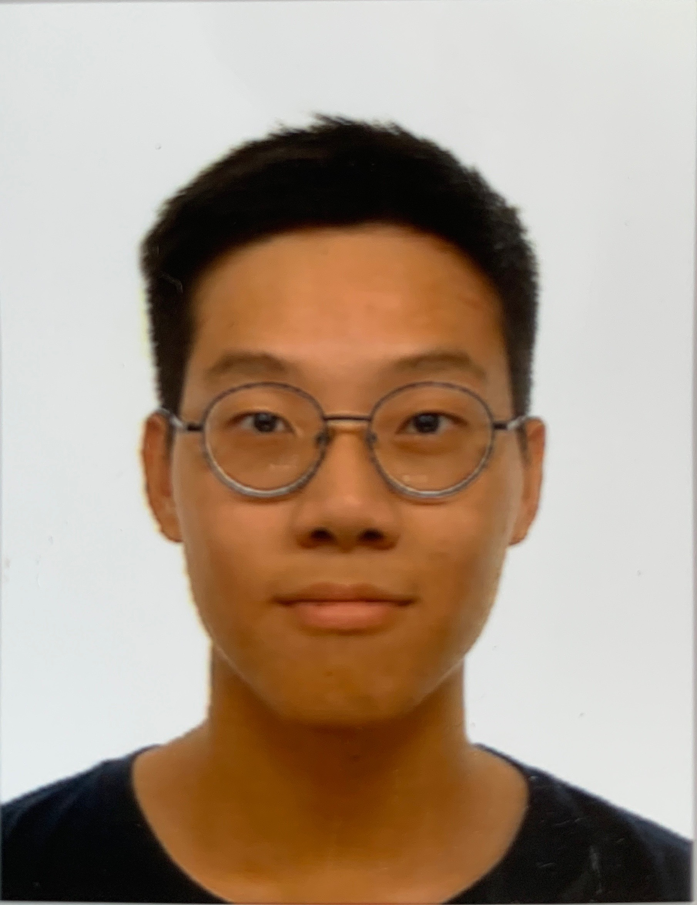
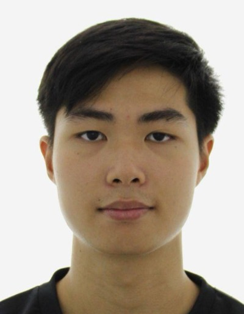
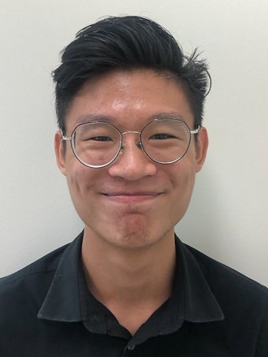

We are a team based in the [School of Computing, National University of Singapore](http://www.comp.nus.edu.sg).

You can reach us at the email `seer[at]comp.nus.edu.sg`

## Project team

### Hong Kunnan

[[github](https://github.com/kunnan97)]
[[portfolio](team/kunnan97.md)]

* Role: Team Lead

### Zhang Xin Yue

[[github](http://github.com/xyzhangg)]
[[portfolio](team/xyzhangg.md)]

* Role: Documentation
* Responsibilities: Data

### Augustine Kau

[[github](http://github.com/augustinekau)]
[[portfolio](team/augustinekau.md)]

* Role: Code Quality
* Responsibilities: UI

### Li Xupeng

[[github](http://github.com/pongzers)]
[[portfolio](team/pongzers.md)]

* Role: Testing
* Responsibilities: Dev Ops + Threading

### Zhao Lingshan

[[github](http://github.com/zhaolingshan)]
[[portfolio](team/zhaolingshan.md)]

* Role: Integration
* Responsibilities: UI
