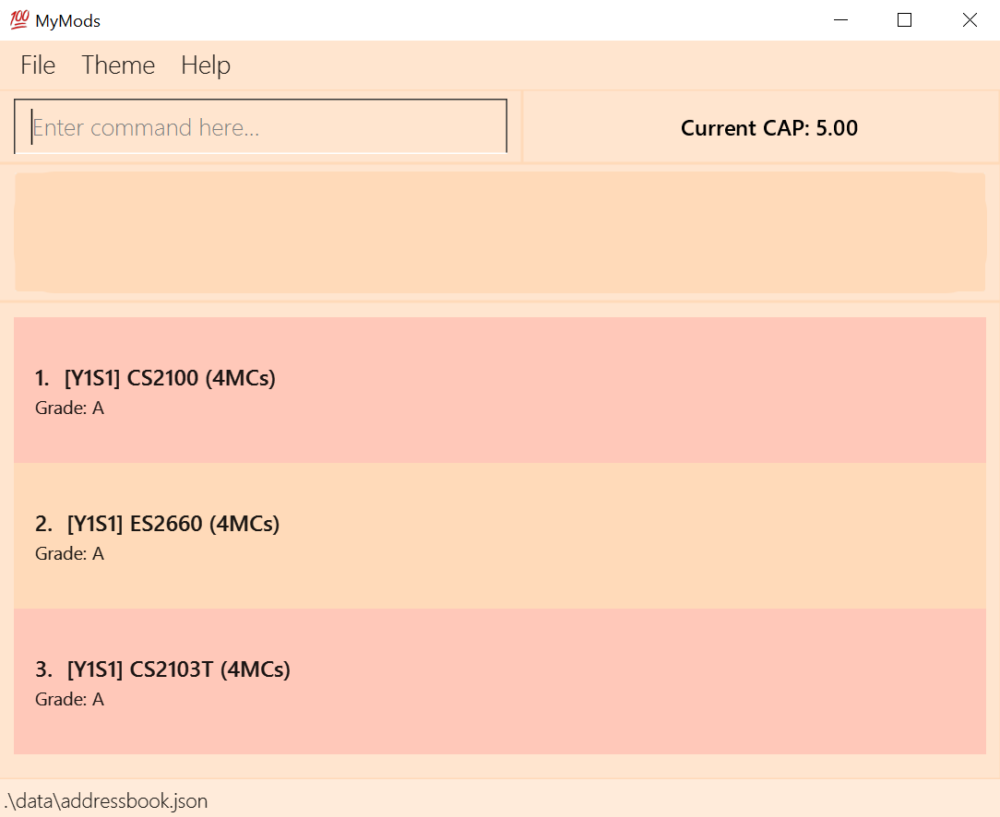

* This is **a project for Software Engineering (SE) students**. 
  Example usages:
* The project simulates an ongoing software project for a desktop application (called _MyMods_) used for managing module details.
  * It is **written in OOP fashion**. It provides a **reasonably well-written** code base **bigger** (around 6 KLoC) than what students usually write in beginner-level SE modules, without being overwhelmingly big.
  * It comes with a **reasonable level of user and developer documentation**.
* It is named `MyMods`.
* For the detailed documentation of this project, see the **[MyMods Product Website](https://ay2021s1-cs2103t-t17-1.github.io/tp/)**.
* This project is a **part of the se-education.org** initiative. If you would like to contribute code to this project, see [se-education.org](https://se-education.org#https://se-education.org/#contributing) for more info.

This project is based on the AddressBook-Level3 project created by the [SE-EDU initiative](https://se-education.org).
